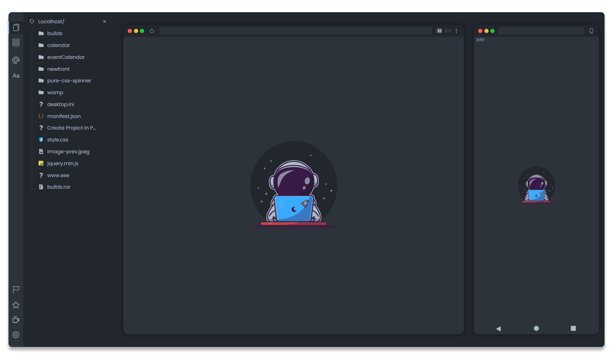

# Astronaut Localhost Extension

  

## Browser Compatibility

 
 

# About 

Astronaut Library.js is a small Library with useful resources for Developers created by André Malveira.

Developed completely with Pure Javascript, the library was mainly created as a browser extension for "localhost" of the Apache, Wamp and Xampp servers.

The extension would just change the default localhost color to a darker color, as a theme, but as the process progressed I came up with new ideas that could be useful for localhost users like me, because those who work with the Apache servers mentioned above, they often access the main localhost to access a project, and for those who like a dark theme and already use it in other programs such as VSCode, Browsers and even the Operating System, I thought they would also like a different localhost with a dark theme and that it wouldn't damage the eyes so much.

So in addition to just changing the default white color to a darker color, I thought of changing the whole look of the page by manipulating the DOM in a way that could be useful for application development like having the project view on the same tab as localhost keeping the list of the other projects on the side, but of course not only with that, but with other tools.

## Features

- Project preview in Desktop and Mobile version.

- Live Server, Real-time update of project changes.

- Open project in Vscode directly from localhost, it is necessary to add the projects directory in settings.

- Access database without leaving localhost, configuration is required to access phpmyadmin.

- Useful Color Palettes.

- Font Typography.

