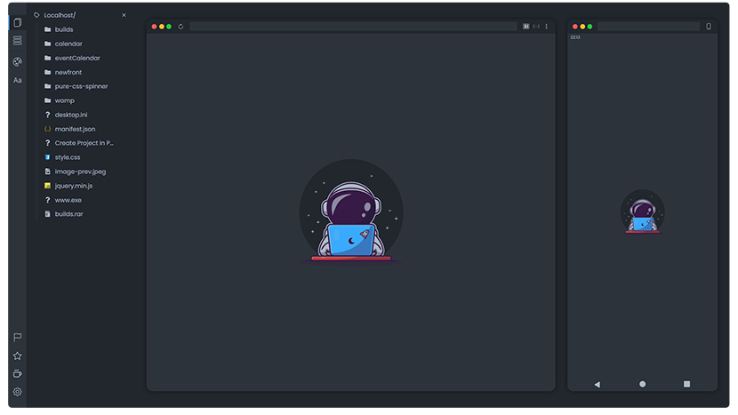

# Astronaut Library .js

&nbsp;&nbsp;&nbsp;&nbsp;

  <a href="https://astlibjs.ga/">Website</a> •
  <a href="https://astlibjs.ga/?p=about#extension-preview">Extension Preview</a> •
  <a href="https://astlibjs.ga/?p=downloads">Downloads</a> •
  <a href="https://github.com/andremalveira/Astronaut.Library.js/issues/new?assignees=&labels=Astronaut+Extension&template=astronaut-extension.md&title=%5BEnter+here+the+type+of+label%5D+-+Insert+the+title+here">Support</a> 

  

# About Extension 

Astronaut Library.js is a small library with useful resources for developers created by André Malveira.

Developed entirely in Pure Javascript, the library was primarily created as a browser extension to customize the default "localhost" environment of Apache, Wamp and Xampp servers.

The extension would just change the default parsing of localhost, but as the process progressed I came up with new ideas that could be useful for application development, like having the project view in the same tab as localhost keeping the list of other projects while side, but of course not only with that, but with other tools. 

## Features

- Project preview in Desktop and Mobile version.
- Live Server, Real-time update of project changes.
- Open project in Vscode directly from localhost, it is necessary to add the projects directory in settings.
- Access database without leaving localhost, configuration is required to access phpmyadmin.
- Useful Color Palettes.
- Font Typography.

## Version

## Browsers Compatibility
&nbsp;&nbsp; 
&nbsp;&nbsp;
&nbsp;&nbsp;
&nbsp;&nbsp;
&nbsp;&nbsp;

 

# Library Resources
Besides the extension, the library also has other tools to use in websites or applications that use javascript.

- [Notify](https://astlibjs.ga/?docs=notify) -> It's like a custom alert but created in order to show notifications.

# License
This extension is licensed under the [MIT License](https://github.com/andremalveira/Astronaut.Library.js/blob/extension/LICENSE)

